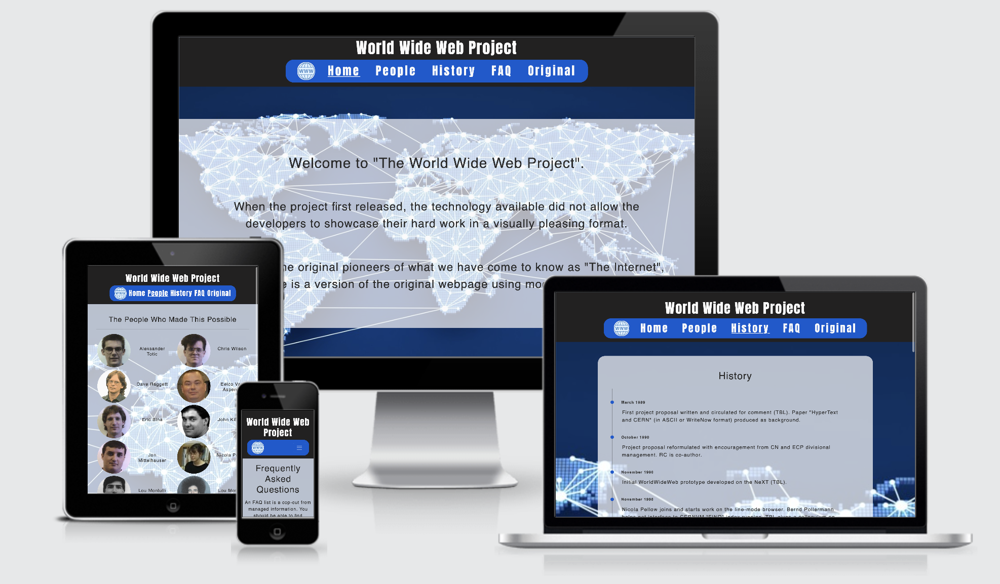
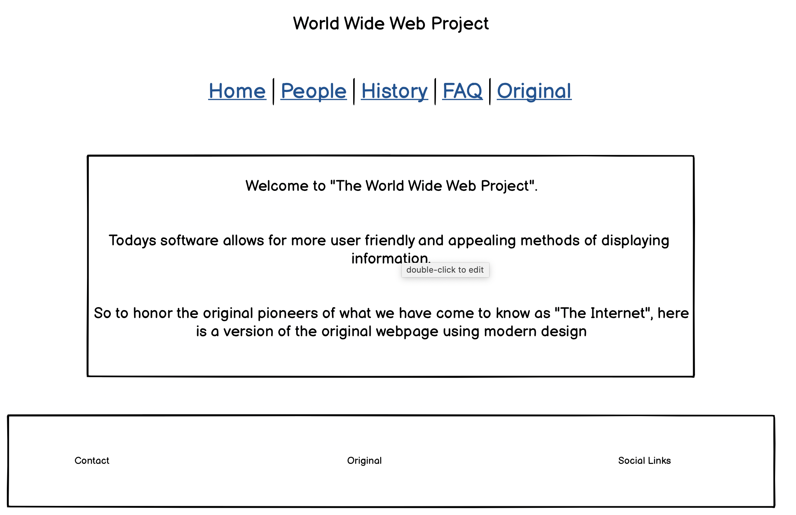
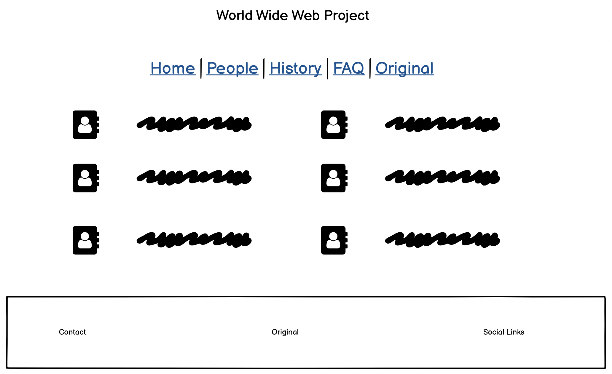
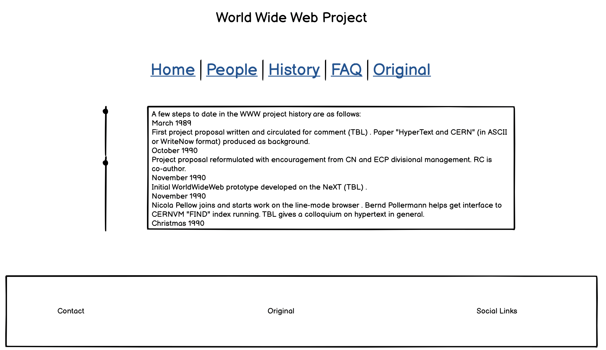

<!-- Copy and paste the converted output. -->

<!-----
NEW: Check the "Suppress top comment" option to remove this info from the output.

Conversion time: 3.383 seconds.

Using this Markdown file:

1. Paste this output into your source file.
2. See the notes and action items below regarding this conversion run.
3. Check the rendered output (headings, lists, code blocks, tables) for proper
   formatting and use a linkchecker before you publish this page.

Conversion notes:

* Docs to Markdown version 1.0β29
* Thu Sep 24 2020 10:21:53 GMT-0700 (PDT)
* Source doc: World Wide Web Project
* This document has images: check for >>>>>  gd2md-html alert:  inline image link in generated source and store images to your server. NOTE: Images in exported zip file from Google Docs may not appear in  the same order as they do in your doc. Please check the images!

----->

**World Wide Web Project**

** **

Live Link -[ https://aramantos.github.io/TestProject/](https://aramantos.github.io/TestProject/)

**Table of Contents**

** **

*   Overview
*   UX
*   Wireframes
*   Features
*   Testing
*   Technologies Used
*   Resources
*   Project barriers and the solutions
*   Deployment
*   Credits
*   Acknowledgments
*   Support

**Overview**

** **

[http://info.cern.ch/hypertext/WWW/TheProject.html](http://info.cern.ch/hypertext/WWW/TheProject.html) was the worlds first website and among the worlds least visited. The idea behind this webpage is to show how far web design has come since its creation and to pay homage to those who started it all.

**UX**

** **

For a product we use everyday I find there is a remarkable lack of knowledge about the history and foundation of how the world wide web started. This webpage is a stepping stone into not only educating people on its history but highlighting the people who created it.

**1. Strategy**

The UX is simple and user-friendly to provide an easy navigation through all pages on the site.

**Project Goals:**

*   Highlighting the progression of web design and internet applications since the first websites deployment.
*   Showcasing the people behind the first website.
*   Providing a brief history on how it all came to be.

**Customer Goals:**

*   Providing a more pleasing and easier to navigate site.
*   The original site had quite a lot of information overload, one of the main focuses was to condense the text into a more readable layout
*   Presenting photos of the people who were behind the development to give it a more human element.
*   

**2. Scope**

*   Creating a fluid layout for ease of use.
*   Implementing and fine tuning my own skills.

**3. Structure**

I designed this page to create a more up to date and eye catching webpage based on the world's first page. The original page is just text based with no styling, my version takes modern internet protocols to allow for much more aesthetically pleasing visuals.

**4. Skeleton**

*   Wireframes: See page 4
*   Fixed navigation bar -  5 page links & brand either side
*   Home, People, History, FAQ and Original
*   Footer with contact info, the original page & social media

**5. Surface**

**Images**

Core of the webpage is the global connectivity image in the background.

**Colours**

The background picture is the basis for the overall colour scheme. 

**Typography**

*   "Anton" font (san serif as backup) for header and footer
*   "Titillium" font (san serif as backup) for all section content.

**Images**

The image selection has been carefully considered to best showcase each reserve.

**User Stories**

“I have always wondered who was behind the development of the internet”

“When was the internet developed and how did it come to be?”

“This site (cern) is not easy to digest”

“The original sites layout and design is quite off putting”

“When was the internet developed and how did it come to be?”

**Wireframes**

** **

**Features**

** **

**Existing Features**

*   Designed with HTML5, CSS3 and Bootstrap.
*   3 separate html pages.
*   Fixed navigation bar.
*   Introduction section animation.

**Features Left to Implement when skills develop**

*   Add more pages so that all information from the original site will be displayed.
*   Adding more animations and transitions for a more visually pleasing site.
*   There is alot of unused viusal real-estate on bigger screen, I would like to add more js connectivity and network visuals at a later date.

**Testing**

** **

Checked compatibility in Safari, Chrome, Firefox

Give examples of tested devices on tools and real life

**Screen Testing**

Checked compatibility in Safari, Chrome, Firefox 

Google Chrome Developer Tools - Device frames tests

Moto G4, Galaxy S5, Pixel 2, Pixel 2 XL, iPhone 5/SE, iPhone 6/7/8, iPhone 6/7/8 Plus, iPhone X, iPad, iPad Pro, Surface Duo, Galaxy Fold

**Validator**

HTML -[ W3C](https://validator.w3.org/) - Markup Validation

CSS -[ W3C](https://jigsaw.w3.org/css-validator/) - CSS Validation

**Header**

*   Home, People, History all forward to correct pages.
*   FAQ & Original open a new tab to correct page
*   Brand icons forward to home page.
*   Header stays fixed on multiple screens sizes and web browsers

**Footer**

*   Globe icon opens new tab to original webpage
*   Social links open new tab to designated social media site

**Bugs**

** **

**Found**

*   Navbar spacing issue with blocked anchors
*   Console error that intermittently appears 
*   Footer columns overlapping at smaller screen width
*   People images displaying irregularly

**Resolved**

*   Footer columns \
Added a &lt;br> on small screens.
*   People images \
Adding “object-fit: fill;” to the images allowed pictures to appear less distorted.

**Unresolved**

*   Navbar spacing issue \
Swapping the “d-none d-md-block” removed the spacing but stopped the other list-items/anchors from appearing in line.
*   Console Issue \
Refreshing the page removes the console error but will reappear eventually, error does not appear to cause any problems visually or with functionality.

**Technologies Used**

** **

**1. Languages**

*   [HTML5](https://en.wikipedia.org/wiki/HTML5)
*   [CSS3](https://en.wikipedia.org/wiki/Cascading_Style_Sheets)
*   [JavaScript](https://en.wikipedia.org/wiki/JavaScript) 

**2. Integrations**

*   [ Bootstrap](https://getbootstrap.com/) - by linking via[ BootstrapCDN](https://www.bootstrapcdn.com/) to HTML Doc.
*    [FontAwesome](https://fontawesome.com/) Icons for Social Media links in Footer.
*    [Google Fonts](https://fonts.google.com/) - Overall Typography import.

**3. Workspace, version control and Repository storage**

*   [GitPod](https://github.com/mkuti/corklagos-venture/blob/master/gitpod.io)  - 	Main workspace IDE(Integrated Development Environment)
*   [Git](https://git-scm.com/)  	 -	Distributed Version Control tool to store 							versions of files and track changes.
*   [GitHub](https://github.com/) - 	A cloud-based hosting service to manage my 						**Git** repositories.

**Resources**

** **

*   [Code Institute Course Content](https://courses.codeinstitute.net/)
*   Code Institute **SLACK Community**
*   [Stack Overflow](https://stackoverflow.com/) - General resource.
*   Bootstrap - General Resource
*   [Youtube](https://www.youtube.com/) - General resource.
*   [CSS-Tricks](https://css-tricks.com/) - General resource.
*   [W3.CSS](https://www.w3schools.com/w3css/4/w3.css) - General resource.
*   [Balsamiq](https://balsamiq.com/wireframes/) - Wire-framing design tool.
*   Unicorn Revealer - Chrome Extension
*   ColorZilla - Chrome Extension

**Project barriers and solutions**

** **

*   Initially the transition from following an instructional video to creating your own code was challenging but eventually that knowledge came to the forefront rather than having to refer back.
*   I started this project with a desktop first approach and as the project went on I certainly realised the benefits of a mobile first approach.

**Deployment**

** **

**GitHub**

*   Under 'Source' drop-down, the 'Master branch' was selected.
*   Once selected, this publishes the project to GitHub Pages and displays the site url.

**Local**

*   You can do this by opening the repository, clicking on the green 'Code' button and selecting either 'clone or download'.
*   The Clone option provides a url, which you can use on your desktop IDE.
*   The Download ZIP option provides a link to download a ZIP file which can be unzipped on your local machine.
*   User needs to open the unzipped folder and open index.html for the homepage to populate.

**Credits**

** **

**Media**

*   Site background image from[ educationworld.in](http://educationworld.in)
*   People Images from various sites
*   Brand logo from[ favpng.com](http://favpng.com)

**Content**

*   All text on history has been lifted from the original site.

	[http://info.cern.ch/hypertext/WWW/History.html](http://info.cern.ch/hypertext/WWW/History.html) 

**Code Snippets**

I have taken and modified snippets from the various projects I have completed by following along with the Code Institute course.

*   Love Running
*   Whiskey Drop
*   Resume Project

**Acknowledgments**

** **

I would like to thank

*   **Rohit Sharma **- My mentor for his guidance throughout the whole process
*   **Jim Lynx **- for his continued support and guidance.
*   **Bim Williams **- for his knowledge and reliable feedback.
*   **Anthony O’Brien **- for his expertise in coding and beyond.
*   **CI staff** and **Slack Community** for round the clock reliability and helpfulness.
*   **#In-It-Together** and **#Study-Group** channels have been an amazing resource and all round support group.

**Support**

** **

If you require any help or assistance you may contact me on 

john.doyle.mail@icloud.com
