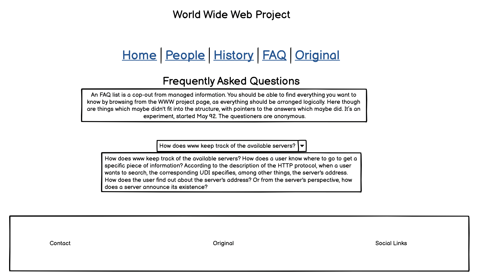

** **

**World Wide Web Project**

** **

Live Link - [https://aramantos.github.io/MS1-World-Wide-Web/](https://aramantos.github.io/MS1-World-Wide-Web/)

** **

#### **Table of Contents**

** **

*   [Overview](#overview)
*   [UX](#ux)
*   [Wireframes](#wireframes)
*   [Features](#features)
*   [Testing](#testing)
*   [Technologies Used](#technologies-used)
*   [Resources](#resources)
*   [Project barriers and the solutions](#project-barriers-and-the-solutions)
*   [Deployment](#deployment)
*   [Credits](#credits)
*   [Acknowledgements](#acknowledgements)
*   [Support](#support)

** **

#### **Overview**

** **

[http://info.cern.ch/hypertext/WWW/TheProject.html](http://info.cern.ch/hypertext/WWW/TheProject.html) was the worlds first website and among the worlds least visited. The idea behind this webpage is to show how far web design has come since its creation and to pay homage to those who started it all.

** **

#### **UX**

** **

For a product we use every day I find there is a remarkable lack of knowledge about the history and foundation of how the world wide web started. This webpage seeks to educate people on the world wide webs history and to highlight the people who created it.

**1. Strategy**

To ensure the UX is simple and user-friendly, by providing easy navigation through all pages on the site.

**Project Goals:**

*   To highlight the progression of web design and internet applications since the development of the first website.
*   To showcase the people behind the first website.
*   To provide a brief history of the development of the world wide web.

**Customer Goals:**

*   Providing an easier to navigate the more visually pleasing site.
*   Minimizing the risk of information overload, by condensing the text into a more readable layout
*   To present photos of the people who were behind the development to give it a more human element.

**2. Scope**

*   To create a fluid layout for ease of use.
*   Fine-tuning and implementing my skills.

**3. Structure**

I designed this page to create a more up to date and eye-catching webpage based on the world's first webpage. The original page is just text-based with no styling. My version utilizes modern internet protocols to create a more aesthetically pleasing visual.

**4. Skeleton**

*   Wireframes: See page 4
*   Fixed navigation bar -  5-page links & brand either side
*   Home, People, History, FAQ and Original
*   Footer with contact info, the original page & social media links

**5. Surface**

**Images**

The core of the webpage is the global connectivity image in the background.

**Colours**

The background picture is the basis for the overall colour scheme. 

**Typography**

*   "Anton" font (san serif as backup) for header and footer
*   "Titillium" font (san serif as backup) for all section content.

**User Stories**

“When was the internet developed and how did it come to be?”

“I have always wondered who was behind the development of the internet.”

“This sites(CERN) layout and design are quite off-putting, I wish it was more engaging.”

**Developer Stories**

"As a developer in training, I have a newfound apprecation for the development process and wanted to highlight the efforts and the people who made the internet possible."

"I believe most developers look back on the CERN site to see how far the field of web design has progressed. I decided to create this website to have a connection to where it all started."

** **

[Return to Table of Contents](#table-of-contents)

** **

#### **Wireframes**

** **

** **

[Return to Table of Contents](#table-of-contents)

** **

#### **Features**

** **

**Existing Features**

*   Designed with HTML5, CSS3 and Bootstrap.
*   4 separate HTML pages.
*   Fixed navigation bar.
*   Introduction section animation.
*   Toggleable buttons to reveal and collapse content.

**Features Left to Implement when skills develop**

*   Add more pages so that all information from the original site will be displayed.
*   When clicked the pictures on people.html would produce a speech bubble with information about the subject.
*   Adding more animations and transitions for a more visually pleasing site.
*   To make use of the unused visual real-estate on a bigger screen, I will add more JS connectivity and network visuals at a later date.

** **

[Return to Table of Contents](#table-of-contents)

** **

#### **Testing**

** **

**Screen Testing**

Checked compatibility in Safari, Chrome, Firefox 

Google Chrome Developer Tools - Device frames tests

Moto G4, Galaxy S5, Pixel 2, Pixel 2 XL, iPhone 5/SE, iPhone 6/7/8, iPhone 6/7/8 Plus, iPhone X, iPad, iPad Pro, Surface Duo, Galaxy Fold

I have tested the website on various devices (iPhone XR, iPad Air, HTC One, Samsung Galaxy S7)

**Validator**

HTML -[ W3C](https://validator.w3.org/) - Markup Validation

CSS -[ W3C](https://jigsaw.w3.org/css-validator/) - CSS Validation

**Defensive Design**

*   Ensuring all target="_blank" links are accompanied by rel="noreferrer".
*   Designing the site to be comfortably navigated without having to use the back button in the browser interface.
*   Giving users the expected functionality of the brand logo in the navbar navigating back to the homepage.

**Header**

*   Clicked Home, People, History, FAQ to ensure being forwarded to the correct pages.
*   Clicked on Original to ensure a new tab opened on correct page.
*   Clicked brand icon forward to the home page.
*   Ensure header stays fixed on multiple screens sizes and web browsers

**Footer**

*   Ensure globe icon opens a new tab to the original webpage
*   Ensure social links open a new tab to the designated social media site

**Buttons**

*   Navbar button replaces anchors on smaller screens and when pressed a dropdown menu allows for further navigation.
*   FAQ accordion buttons all correctly drop down and collapse when clicked. 

** **

**Bugs**

** **

**Found**

*   Navbar spacing issue with blocked anchors
*   Console error that intermittently appears in developer tools
*   Footer columns overlapping at a smaller screen width
*   People images displaying irregularly

**Resolution**

*   Navbar spacing issue \
Implemented a dropdown menu to appear after the screen has reach 575px and below.
*   Console Issue \
Caused by not having a favicon icon implemented; resolved by attached by attaching the favicon link.
*   Footer columns \
Added a &lt;br> on small screens.
*   People images \
Adding “object-fit: fill;” to the images allowed pictures to appear less distorted.

**Unresolved**

*   When being viewed on an iPad, the mobile number in the contact section appears much larger then expected.

** **

[Return to Table of Contents](#table-of-contents)

** **

#### **Technologies Used**

** **

**1. Languages**

*   [HTML5](https://en.wikipedia.org/wiki/HTML5)
*   [CSS3](https://en.wikipedia.org/wiki/Cascading_Style_Sheets)
*   [JavaScript](https://en.wikipedia.org/wiki/JavaScript) 

**2. Integrations**

*    [Bootstrap](https://getbootstrap.com/) - by linking via[ BootstrapCDN](https://www.bootstrapcdn.com/) to HTML Doc.
*    [FontAwesome](https://fontawesome.com/) Icons for links in Footer.
*    [Google Fonts](https://fonts.google.com/) - Overall Typography import.

**3. Workspace, version control and Repository storage**

*   [GitPod](https://github.com/mkuti/corklagos-venture/blob/master/gitpod.io)  - 	Main workspace IDE(Integrated Development Environment)
*   [Git](https://git-scm.com/)  	 -	Distributed Version Control tool to store 							versions of files and track changes.
*   [GitHub](https://github.com/) - 	A cloud-based hosting service to manage my 						**Git** repositories.

** **

[Return to Table of Contents](#table-of-contents)

** **

#### **Resources**

** **

*   [Code Institute Course Content](https://courses.codeinstitute.net/)
*   Code Institute **SLACK Community**
*   [Stack Overflow](https://stackoverflow.com/) - General resource.
*   Bootstrap - General Resource
*   [Youtube](https://www.youtube.com/) - General resource.
*   [CSS-Tricks](https://css-tricks.com/) - General resource.
*   [W3.CSS](https://www.w3schools.com/w3css/4/w3.css) - General resource.
*   [Balsamiq](https://balsamiq.com/wireframes/) - Wire-framing design tool.
*   Unicorn Revealer - Chrome Extension
*   ColorZilla - Chrome Extension

** **

[Return to Table of Contents](#table-of-contents)

** **

#### **Project barriers and the solutions**

** **

*   Initially, the transition from following an instructional video to creating your own code was challenging but eventually overcome through perseverance and assistance from the slack community.
*   I started this project with a desktop-first approach and as the project went on I certainly realised the benefits of a mobile-first approach.

** **

[Return to Table of Contents](#table-of-contents)

** **

#### **Deployment**

** **

GitPod was used to write all code in this repository and pushed via Git to GitHub.

**GitHub**

*   When viewable HTML files have been pushed to GitHub, select 'Settings' the last item in the repository navbar. 
*   Under 'Github Pages' and 'Source' there should be a drop-down menu with 'None' selected by default.
*   After you press the drop-down menu and select 'master', then press save.
*   Once saved, this will shortly publish the project to GitHub Pages and the site URL will be available in the 'GitHub Pages' in 'Settings'.

**Local Download/Clone**

*   You can do this by opening the repository, clicking on the 'Code' button with the download icon and selecting either 'clone or download'.
*   The Clone option provides a URL, which you can use on your desktop IDE.
*   The Download ZIP option provides a link to download a ZIP file which can be unzipped on your local machine.
*   User needs to open the unzipped folder and open index.html for the homepage to populate.

** **

[Return to Table of Contents](#table-of-contents)

** **

#### **Credits**

** **

**Media**

*   Site background image from[ educationworld.in](http://educationworld.in)
*   People Images 
    * https://www.w3.org/People.html
    * https://alchetron.com/cdn/eelco-van-asperen-0bfdb23d-6579-4990-8d0f-51a759e1c56-resize-750.jpg/
    * http://www.tech-heroines.org/2017/09/nicola-pellow.html
    * https://qt.azureedge.net/resources/authors-images-large/robert-cailliau.jpg/
    * https://media.vanityfair.com/photos/5b351925384c1d5c5734bf99/master/w_2560%2Cc_limit/founder-of-the-web-08-2018-lede.jpg/
    * Brand logo from[favpng.com](http://favpng.com)

**Content**

*   All text on History and FAQ has been lifted from the original site.

	[http://info.cern.ch/hypertext/WWW/History.html](http://info.cern.ch/hypertext/WWW/History.html) 

**Code Snippets**

I have taken and modified snippets from the various projects I have completed by following along with the Code Institute course.

*   Love Running
*   Whiskey Drop
*   Resume Project

** **

[Return to Table of Contents](#table-of-contents)

** **

#### **Acknowledgements**

** **

I would like to thank

*   **Guido Cecilio** - My mentor for his time and guidance.
*   **Rohit Sharma** - For his advice and instruction.
*   **Jim Lyn** - For his continued support and assistance.
*   **Bim Williams** - For his knowledge and reliable feedback.
*   **Anthony O’Brien** - For his expertise in the industry.
*   **CI staff** and **Slack Community** for round the clock reliability and helpfulness.
*   **#In-It-Together** and **#Study-Group** channels have been an amazing resource and all-round support group.

** **

#### **Support**

** **

If you require any help or assistance you may contact me on 

john.doyle.mail@icloud.com
